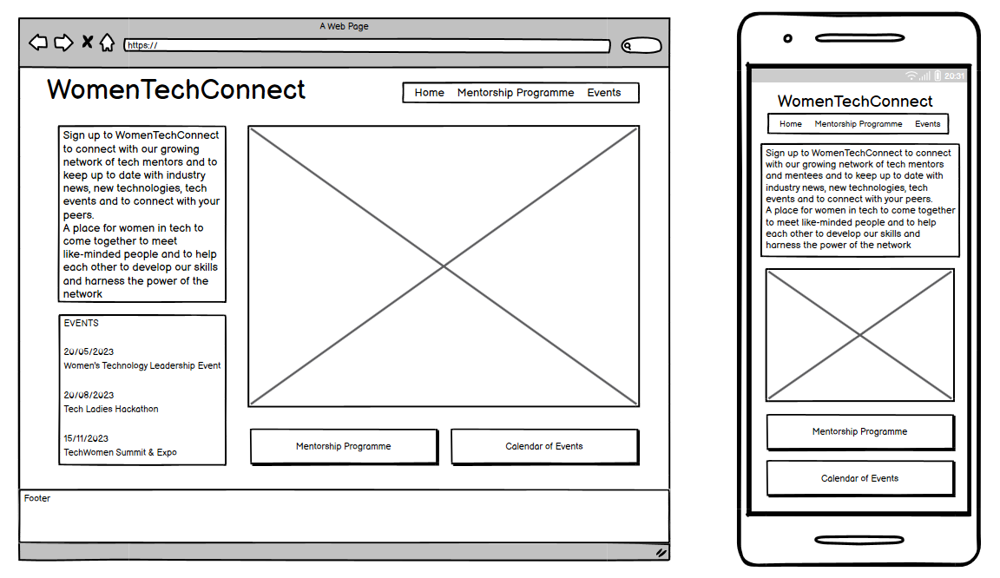
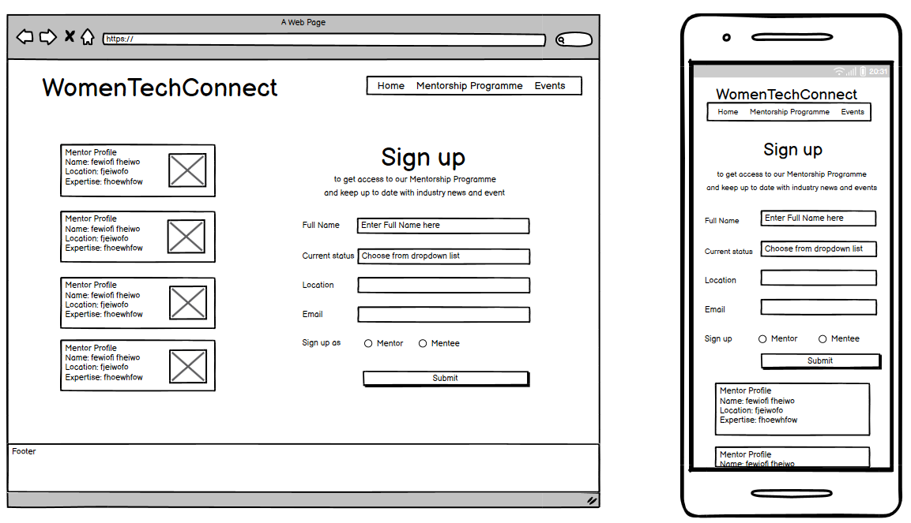
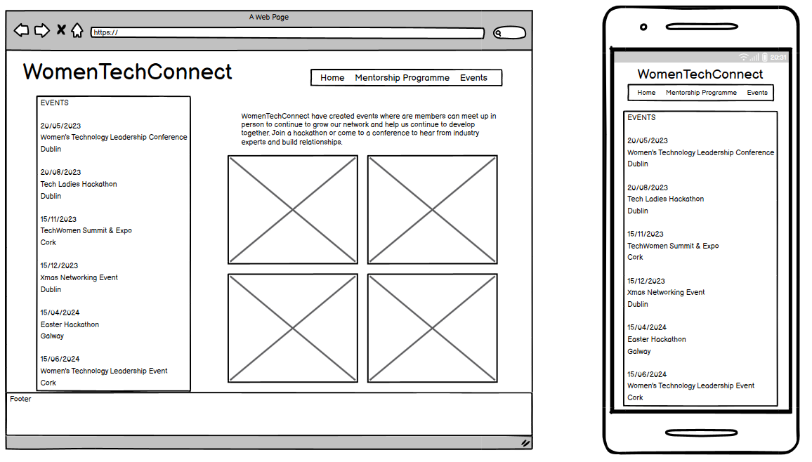

# TechWomenConnect
​
## Team Name: TechWomenConnect
​
[Link to Deployed Project](https://womentechconnect.herokuapp.com/)
​
## Contents
​
* [User Experience (UX)](#user-experience)
  * [User Stories](#user-stories)
* [Technology](#technology)
* [Design](#design)
  * [Color Scheme](#color-scheme)
  * [Typography](#typography)
  * [Imagery](#imagery)
  * [Wireframes](#wireframes)
* [Deployment & Usage](#deployment)
* [Testing](#testing)
* [Credits](#credits)
  * [Code](#code)
  * [Content](#content)
  * [Media](#media)
  * [Acknowledgements](#acknowledgements)
​
## User Experience
* 

​
### User stories
* 

<< user stories here - don't be stingy on this 😅 you can even put down your expectations as a developer in this forum >>
​
## Technology:

### Tech Stack
​

### Languages:

*HTML: HTML was used to create the basic architecture of our website.
*CSS: We used CSS to style our HTML elements, making them more eye catching to improve the user experience.
*JavaScript:We chose JavaScript to generate an eyecatching and well presented website, providing a high quality user experience.
*Bootstrap: Boostrap enables building of webpages quickly, which is key in short turnaround project.
​
* << tools >>
  * << list the tool & reason for using it >>
​
## Initial MVP idea:
​
Following the initial team meeting, project ideas were shared and the agreed idea was to work on creating a platform to connect female mentors and mentees working in the tech industry. 
​
### Actual idea & content:
​
The goal of our mentorship program is to accelerate the personal and professional development of our mentees for the benefit of all. We are growing a network of women in the technology industry which matches experienced leaders with individuals entering the community. You can search through our extensive list of mentors who are looking to work with women and share their experiences to ensure their mentees meet their potential. Filter through the categories to find the right mentor for you and schedule a call. By sharing our experiences we can help our peers to accelerate their career growth and help them to navigate the rapidly growing industry. In our experience mentoring increases career progression, promotion rates, and employee satisfaction for both the mentors and mentees. Mentors get the opportunity to develop their leadership and communication skills and gain new perspectives along with the knowledge that they are building the next generation of female developers.
​
- File structure:
    
    - index.html
    - search.html
    - inspiration.html
    - signup.html
    - signin.html
    - signup.html
    - thankyou.html
    - logout.html
    - 404.html (error handling)
    - assets folder >
        - images > 
            - inspiration > inspo images
            - all copyright free images for mentor profile pics
        - css > style.css file
        - js > 
            - script.js file
​
## Design
​
### Color Scheme:

- #F67280
- #F8B195
- #C06C84
- #6C5B7B
- #355C7D
​
### Typography:
Lato and Roboto were used from Google Fonts
​
### Imagery:

pexels.com was used to source copyright free images for the website gallery and tinypng was used to compress file size
​
### Logo:

- logo icon was created using https://www.freelogodesign.org/
- https://favicon.io/ was used to create the favicon

### Wireframes:
​

​
​​
​
## Deployment
- Login to Github
- Click on the GitHub repository for this project (https://github.com/Jade-ux/WomenTechConnect)
- Click on the Settings tab, then choose Pages from the left hand menu 
- From the source section drop-down menu, select the Main Branch
- Once the main branch has been selected, click save.
- The page will refresh with a notification that” Your site is live”
- Any changes pushed to the master branch will take effect on the live project

  The live link can be found here - [WomenTechConnect](https://womentechconnect.herokuapp.com/) 
​
## Testing

​
## Credits
​
### Code
<< any and all code that isn't yours...must go here >>
​
### Content
<< any content, such as facts/references/text that isn't yours...must go here >>
​
### Media
<< you may have already done this above in the Imagery section, but just in case, please attribute Media acquisition here >>
​
### Acknowledgements
<< personal thanks and praise 🙌 >>