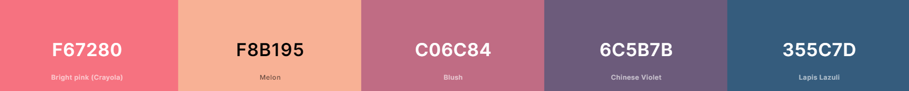
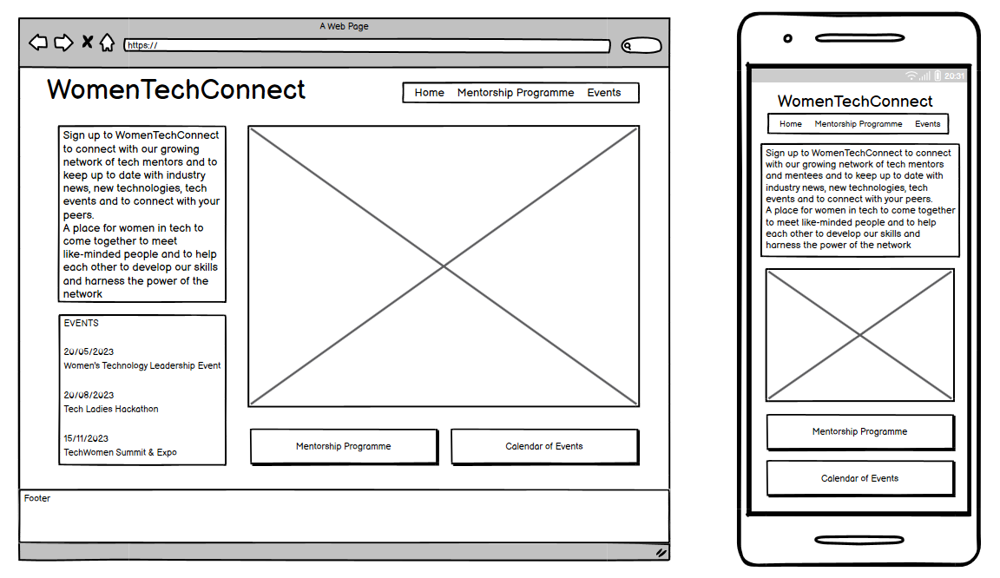
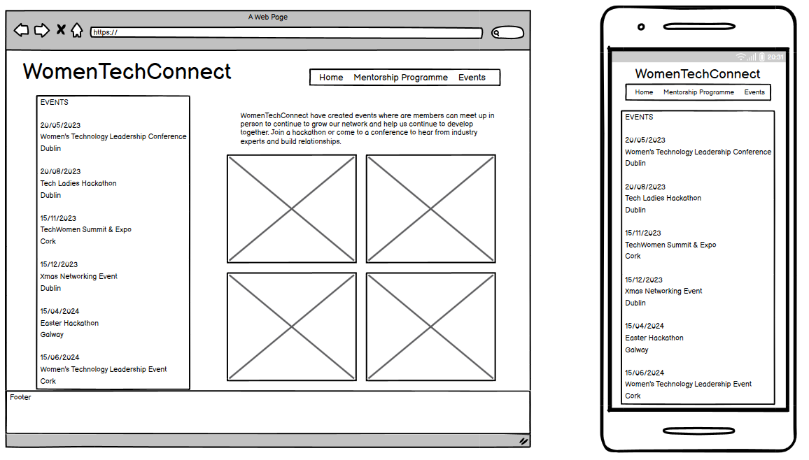
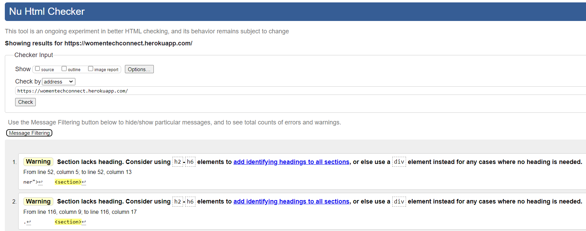
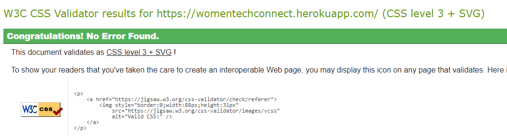
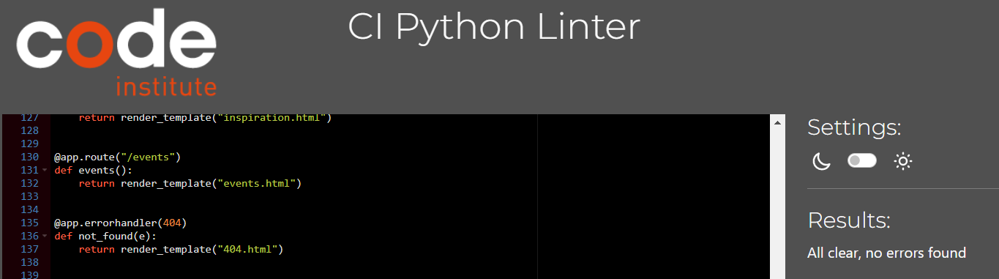

# TechWomenConnect
​
## Team Name: TechWomenConnect
​
[Link to Deployed Project](https://womentechconnect.herokuapp.com/)

​
## Contents
​
* [User Stories (UX)](#user-stories)
* [Features](#features)
* [Technology](#technology)
* [Design](#design)
  * [Color Scheme](#color-scheme)
  * [Typography](#typography)
  * [Imagery](#imagery)
  * [Wireframes](#wireframes)
* [Deployment & Usage](#deployment)
* [Testing](#testing)
* [Credits](#credits)
  * [Code](#code)
  * [Content](#content)
  * [Media](#media)
  * [Acknowledgements](#acknowledgements)
​
​
## User Stories

- As a user looking for a mentor, I want to browse mentors and filter by skills, areas of interest and availability
- As a user, I want to sign up to receive news and updates from the site
- As a user I want to be able to browse upcoming events and read details such as location, topic and how to attend
- As a user I want to be able to read stories about inspirational women in the 'Inspiration' section of the site
- As a user looking for a mentor, I want to be able to sign up as a mentee, using a form and entering my:
    - name
    - current status
    - location
    - my email address (will be hidden from users)
    - password
- As a user looking for a mentor, I want to be able to contact mentors via a contact form on the site
- As a user looking to mentor other women, I want to be able to enter my details on a form, including:
    - name
    - current status
    - location
    - my email address (will be hidden from users)
    - password

## Features

### Mentor Search
In the 'Mentorship Program' section of the page, there is the ability to search for a mentor based on selected criteria. Using radio buttons, users can select certain categories, this will then limit the mentors shown to ones that match the criteria.

The available categories are 'Role', 'Location', 'Skills' and 'Career Progression:

Each mentor card will contain a section dedicated to content that relates to the search criteria:

Each mentor card contains custom data attributes that relate to the value of the checkbox input elements. When the user selects the criteria that they would like to search for, they then confirm their selection by pressing the 'Search' button. All of the cards are then hidden by default. Next, JavaScript and jQuery are used to compare the checkbox value with the data attributes, if they match then the related mentor card is shown.

These selections use the OR operator rather than AND, this means that if a user selects 'Dublin' and 'Software Development', then they will be shown mentors that either are from Dublin or those that are not from Dublin but are Software Developers. This was used to allow users to get a wide range of mentors rather than limiting the number that can be shown.

## Technology:

### Tech Stack
​
Technologies Used: HTML, CSS, JavaScript, jQuery, Bootstrap, Python, Flask, Heroku, GitHub, Git, Bash, Gitpod

GitHub URL: https://github.com/Jade-ux/WomenTechConnect 

Deployed URL:  https://womentechconnect.herokuapp.com/
​
## Initial MVP idea:
​
Following the initial team meeting, project ideas were shared and the agreed idea was to work on creating a platform to connect female mentors and mentees working in the tech industry. 
​
### Actual idea & content:
​
A web application developed as a part of Code Institute's March Hackathon based on the theme of women in tech. It features services that allow for effective communication for women in navigating the tech industry. The project achieves this by presenting mentorship opportunities through mentor profile cards where users can schedule meetings with the personalities that they feel they associate with the most. Users can find a list of upcoming events that encourage networking among women in tech. And the project also features an inspiration feature where users are presented with profiles of successful women figures.
​
- File structure:
    
    - index.html
    - search.html
    - inspiration.html
    - team.html
    - signin.html
    - signup.html
    - thankyou.html
    - logout.html
    - 500.html
    - 404.html (error handling)
    - assets folder >
        - images > 
            - inspiration > inspo images
            - all copyright free images for mentor profile pics
        - css > style.css file
        - js > 
            - script.js file
​
## Design
​
### Color Scheme:

- #F67280
- #F8B195
- #C06C84
- #6C5B7B
- #355C7D
​
### Typography:
Lato and Roboto were used from Google Fonts
​
### Imagery:

pexels.com was used to source copyright free images for the website gallery and tinypng was used to compress file size
​
### Logo:

- logo icon was created using https://www.freelogodesign.org/
- https://favicon.io/ was used to create the favicon

### Wireframes:
​

​
​​
​
## Deployment
- Login to Github
- Click on the GitHub repository for this project (https://github.com/Jade-ux/WomenTechConnect)
- Click on the Settings tab, then choose Pages from the left hand menu 
- From the source section drop-down menu, select the Main Branch
- Once the main branch has been selected, click save.
- The page will refresh with a notification that” Your site is live”
- Any changes pushed to the master branch will take effect on the live project

  The live link can be found here - [WomenTechConnect](https://womentechconnect.herokuapp.com/) 
​
## Testing

### Validator testing

* HTML:

​

* CSS:

​

​* JS:

No warnings when using [JSHint](https://jshint.com/):

​* Python:

​

## Credits
​
### Code
<< any and all code that isn't yours...must go here >>
​
### Content

* Inspiration Page:
  * [ChatGPT](https://chat.openai.com/) was used to create the content.

### Media
 
* Inspiration Page:
  * [Ada Lovelace](https://images.newscientist.com/wp-content/uploads/2021/05/11162637/ada-lovelace-htkrgb_web.jpg)
  * [Marie Curie](https://upload.wikimedia.org/wikipedia/commons/thumb/c/c8/Marie_Curie_c._1920s.jpg/1200px-Marie_Curie_c._1920s.jpg)
  * [Florence Nightingale](https://upload.wikimedia.org/wikipedia/commons/a/ab/Florence_Nightingale_%28H_Hering_NPG_x82368%29.jpg)
  * [Katherine Johnson](https://www.nasa.gov/sites/default/files/thumbnails/image/26646856911_ca242812ee_o_1.jpg)
  * [Dorothy Vaughan](https://upload.wikimedia.org/wikipedia/commons/9/98/Dorothy_Vaughan_2.jpg)
  * [Williamina Fleming](https://upload.wikimedia.org/wikipedia/commons/thumb/7/79/Williamina_Paton_Stevens_Fleming_circa_1890s.jpg/1200px-Williamina_Paton_Stevens_Fleming_circa_1890s.jpg)
  * [Gladys West](https://i.guim.co.uk/img/media/91830bf543b0ab70a1cf28f83d9d97d9c42cdd0b/0_0_2228_2785/master/2228.jpg?width=700&quality=85&auto=format&fit=max&s=83232b0e6ba8f529d9d7e5a133f55169)
  * [Stephanie Kwolek](https://www.timeforkids.com/wp-content/uploads/2020/08/AG_stephanie.jpg)
  * [Katharina Paulus](https://upload.wikimedia.org/wikipedia/commons/2/28/K%C3%A4the_Paulus_ca._1890_Fotomontage_3256644_1450825047-e1450825180454.jpg)
​

### Acknowledgements
<< Thanks to the CI Hackteam for putting together this dream team. It has been a really positive experience and we are super proud of what we have produced together in such a short space of time.  🙌 >>